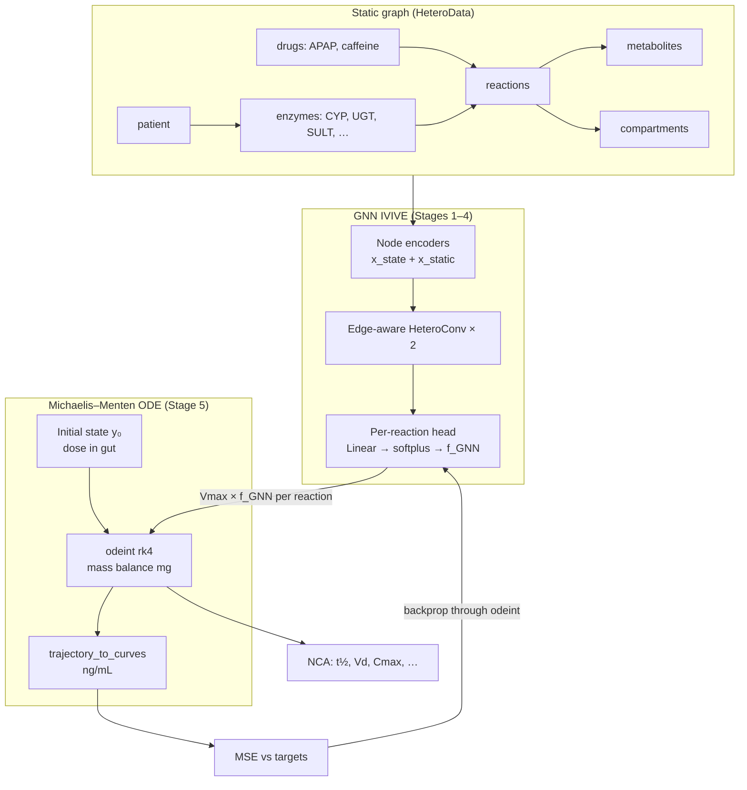

# PharmMLPK MVP

A differentiable pharmacokinetics (PK) engine that couples a **heterogeneous graph neural network (GNN)** with a **Michaelis–Menten ordinary differential equation (ODE)** solver. The model predicts multi-drug plasma and metabolite concentration–time profiles and mechanistic drug–drug interactions (DDIs) for a co-administered **acetaminophen (APAP)** and **caffeine** scenario.

The GNN acts as an **in vitro → in vivo extrapolation (IVIVE)** layer: it reads static graph structure (chemistry, enzyme abundance, literature kinetics) and emits per-reaction **Vmax modulation factors** (`f_GNN`). Those factors scale mechanistic enzyme rates inside a mass-conserving ODE integrated with `torchdiffeq`. Gradients flow end-to-end from concentration targets back into GNN weights.

---

## High-level overview

| Layer | Role | What varies over time? |
|-------|------|------------------------|
| **Heterogeneous graph** (`build_graph.py`) | Encodes patient, dosing, compartments, enzymes, reactions, metabolites, and literature parameters (Km, Kcat, Ki, ka, distribution rates) | Nothing — graph nodes hold **static** features only |
| **Edge-aware GNN** (`gnn_ode.py`) | Two-layer `HeteroConv` + `GATv2Conv` message passing with edge attributes; reaction-level readout (no global pooling) | Nothing — outputs fixed modulation factors per integration |
| **Michaelis–Menten ODE** (`gnn_ode.py`) | Tracks drug/metabolite **mass (mg)** across gut, plasma, liver, sinks; competitive enzyme denominators couple substrates and inhibitors | **Yes** — 15-state vector integrated over hours |

**Design principle:** spatial pools (gut, plasma, liver) live in the ODE state vector, not as separate graph nodes per compartment. Each parent drug is a single `drug` node; mass movement is handled strictly by the ODE.

---

## Architectural flow



### Pipeline stages

1. **Graph construction** — `build_dummy_graph()` assembles a `HeteroData` object: Morgan fingerprints for chemical entities, patient covariates, enzyme baseline abundance, reaction edges with Km/Kcat/Ki, absorption and distribution parameters, and competitive inhibition wiring between drugs and shared enzymes.

2. **GNN encoding & message passing** — Node features concatenate dynamic placeholders (`x_state`, zeros at inference) with static parameters (`x_static`). Two edge-aware heterogeneous convolution layers propagate context along typed edges (e.g. `enzyme → catalyzes → reaction`, `drug → competitively_inhibits → enzyme`).

3. **Reaction-level readout** — Embeddings on `reaction` nodes pass through a linear head + `softplus` to produce one positive **Vmax modulation factor** per enzymatic reaction. The GNN does **not** predict raw Km or Kcat; it scales the graph-derived mechanistic `Vmax_base = Kcat × effective_abundance`.

4. **ODE integration** — `build_ode_index()` derives reaction ↔ state ↔ enzyme wiring from graph topology. `MichaelisMentenODE` integrates a 15-dimensional mass vector (parent drugs, metabolites, GSH pool, necrosis and urine sinks) with:
   - first-order gut absorption
   - plasma ↔ liver distribution
   - competitive Michaelis–Menten metabolism (shared enzyme denominators → DDI)
   - GSH co-substrate gating and regeneration
   - renal clearance into a urine sink

5. **Training** — `src/train.py` generates synthetic concentration targets from a teacher ODE with known `TRUE_FACTORS`, then fits the GNN end-to-end via MSE on parent and metabolite concentrations at multiple timepoints. Best weights are saved to `results/best_model.pt`.

6. **Inference & analysis** — `simulate.py` integrates the ODE with either neutral factors (1.0) or trained GNN factors (checkpoint required). `metrics.py` computes NCA-style PK metrics (terminal half-life via log-linear regression, systemic Vd, Cmax, AUC). Plotting scripts write figures under `results/`.

---

## ODE state vector (15 compartments, mg)

| Index | State | Description |
|-------|-------|-------------|
| 0–2 | `A_gut/plasma/liver_apap` | APAP mass pools |
| 3–4 | `A_napqi`, `A_gsh` | Reactive metabolite & glutathione pool |
| 5–7 | `A_gut/plasma/liver_caffeine` | Caffeine mass pools |
| 8–12 | Metabolite states | Paraxanthine, APAP gluc/sulf, theobromine, theophylline |
| 13–14 | `A_necrosis`, `A_urine_sink` | Irreversible sinks (mass balance closed) |

Species are tracked in **parallel** — APAP and caffeine masses are never summed. Interaction occurs only through shared enzyme competition terms.

---

## Prerequisites

- **Python 3.10+** (tested with Python 3.10 on macOS)
- Terminal access from the project root (`PharmMLPK_MVP/`)

Check Python:

```bash
python3 --version
```

---

## Setup

### 1. Create the virtual environment

Run from the **project root**:

```bash
cd /path/to/PharmMLPK_MVP
python3 -m venv .venv
```

### 2. Activate the environment

**macOS / Linux:**

```bash
source .venv/bin/activate
```

**Windows (PowerShell):**

```powershell
.venv\Scripts\Activate.ps1
```

### 3. Install dependencies

```bash
python -m pip install --upgrade pip
pip install -r requirements.txt
```

**PyTorch Geometric:** `torch-geometric`, `torch-scatter`, and `torch-sparse` must match your PyTorch build. If the PyG wheels fail, install PyTorch first, then follow the [official PyG install guide](https://pytorch-geometric.readthedocs.io/en/latest/install/installation.html).

### 4. Verify the environment

```bash
export PYTHONPATH="${PYTHONPATH:+$PYTHONPATH:}$(pwd)"   # macOS/Linux
python tests/test_environment.py
```

You should see package versions and `Environment check PASSED.`

---

## Running the pipeline

All commands assume the project root with `.venv` activated and `PYTHONPATH` set.

### Train the GNN–ODE model

End-to-end training with synthetic teacher targets; saves `results/best_model.pt`:

```bash
python -m src.train
```

### Smoke-test the model forward pass

```bash
python -m src.models.gnn_ode
```

### Simulate PK trajectories

Neutral (mechanistic-only) factors:

```bash
python -m src.simulate
```

With trained GNN modulation factors (requires checkpoint):

```python
from src.simulate import run_simulation
t, traj, data = run_simulation(use_gnn_factors=True)
```

### Plot PK metrics and drug amounts

```bash
python -m src.plot_pk_metrics --use-gnn-factors
python -m src.plot_drug_amounts --use-gnn-factors
```

Optional flags: `--hours 48`, `--output results/my_plot.png`, `--show`.

### Utility scripts

```bash
python scripts/inspect_checkpoint.py      # summarize saved weights
python scripts/export_graph_to_excel.py   # export graph structure for review
```

---

## Project layout

```
PharmMLPK_MVP/
├── data/
│   ├── raw/                  # raw CSVs (gitignored)
│   └── processed/
├── results/
│   ├── best_model.pt         # trained GNN weights (from src.train)
│   └── *.png                 # plot outputs
├── scripts/
│   ├── export_graph_to_excel.py
│   └── inspect_checkpoint.py
├── src/
│   ├── data/
│   │   ├── build_graph.py    # heterogeneous PK graph builder
│   │   └── load_data.py
│   ├── models/
│   │   ├── gnn_ode.py        # GNN + Michaelis–Menten ODE (main model)
│   │   ├── gnn_model.py      # early placeholder GNN
│   │   └── edge_aware_gnn.py # edge-aware GNN prototype
│   ├── training/
│   │   └── train.py          # legacy dummy training loop
│   ├── utils/
│   │   └── config.py
│   ├── train.py              # end-to-end GNN–ODE training
│   ├── simulate.py           # shared integration entry point
│   ├── metrics.py            # NCA PK metrics from trajectories
│   ├── plot_pk_metrics.py    # plasma concentration plots
│   └── plot_drug_amounts.py  # compartment amount plots
├── tests/
│   └── test_environment.py
├── requirements.txt
└── README.md
```

---

## Key files

| File | Purpose |
|------|---------|
| `src/data/build_graph.py` | Builds the heterogeneous PK graph (nodes, edges, Morgan fingerprints, literature kinetics) |
| `src/models/gnn_ode.py` | `GNNODEModel`, `MichaelisMentenODE`, `build_ode_index`, state definitions |
| `src/train.py` | Synthetic-data training loop; checkpoint export |
| `src/simulate.py` | Loads checkpoint and integrates ODE for analysis |
| `src/metrics.py` | Post-hoc NCA: terminal t½, Vd, Cmax, AUC |

---

## Troubleshooting

| Issue | Suggestion |
|-------|------------|
| `ModuleNotFoundError: src` | Set `PYTHONPATH` to the project root or use `python -m src....` |
| PyG install fails | Install matching wheels from [pyg.org](https://data.pyg.org/whl/) for your torch version |
| `--use-gnn-factors` raises `FileNotFoundError` | Run `python -m src.train` first to create `results/best_model.pt` |
| MPS on Apple Silicon | PyTorch uses `mps` when available |
| ODE NaNs during training | Training loop rolls back to best weights and reduces LR on divergence |

---

## License

Add your license here.
