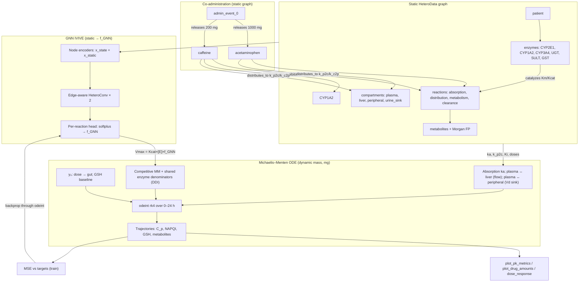
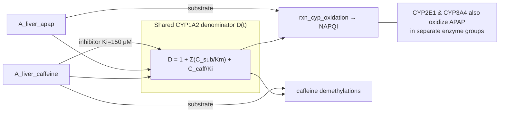

# PharmMLPK MVP

A differentiable pharmacokinetics (PK) engine that couples a **heterogeneous graph neural network (GNN)** with a **Michaelis–Menten ordinary differential equation (ODE)** solver. The primary use case is **co-administered acetaminophen (APAP) and caffeine**: simulate how each drug's mass, metabolites, and enzyme occupancy **evolve over time**, and how **mechanistic drug–drug interactions (DDIs)** emerge when both share hepatic enzymes.

The GNN acts as an **in vitro → in vivo extrapolation (IVIVE)** layer: it reads static graph structure (chemistry, enzyme abundance, literature kinetics) and emits per-reaction **Vmax modulation factors** (`f_GNN`). Those factors scale mechanistic enzyme rates inside a mass-conserving ODE integrated with `torchdiffeq`. **DDI physics live in the ODE** (shared Michaelis–Menten denominators + competitive inhibition edges); the GNN modulates reaction strength but does not replace the interaction math. Gradients flow end-to-end from concentration targets back into GNN weights during training.

---

## Project goal: DDI over time

| Question | Where it is answered |
|----------|----------------------|
| How do APAP and caffeine PK change when given together? | Coupled 17-state ODE (default co-administration) |
| What is the mechanistic interaction? | Shared **CYP1A2** denominator: substrate competition ($\sum C/K_m$) + `caffeine → competitively_inhibits → CYP1A2` ($K_i = 150\ \mu\text{M}$) |
| How does interaction evolve over 0–24 h? | Time-resolved trajectories: parent plasma mass, NAPQI, GSH, caffeine metabolites |
| How much does each drug affect the other vs monotherapy? | Run paired scenarios via `dose_overrides` in `simulate.py` (see [Observing DDI](#observing-ddi)) |

**Design principle:** each parent drug is a **single graph node**; spatial pools (gut, plasma, liver, peripheral) and metabolite masses live in the **ODE state vector**, not as duplicate drug nodes. APAP and caffeine masses are **never summed** — they interact only through shared enzyme terms.

---

## High-level overview

| Layer | Role | What varies over time? |
|-------|------|------------------------|
| **Heterogeneous graph** (`build_graph.py`) | Static mechanism map: patient, dosing, compartments, enzymes, reactions, metabolites, Morgan fingerprints, Km/Kcat/Ki, ka, distribution rates, DDI edges | Nothing — nodes hold **static** features only |
| **Edge-aware GNN** (`gnn_ode.py`) | Two-layer `HeteroConv` + `GATv2Conv`; per-reaction readout → `f_GNN` | Nothing — outputs fixed modulation factors per integration |
| **Michaelis–Menten ODE** (`gnn_ode.py`) | Tracks **mass (mg)** across gut, plasma, liver, peripheral, metabolites, sinks; competitive enzyme denominators couple substrates and inhibitors | **Yes** — 17-state vector integrated over hours |

### Graph vs ODE (why they look different)

The **graph** is a rich static scaffold for GNN message passing (including topology edges like `plasma ↔ apap_distribution ↔ liver`). The **ODE** integrates a smaller, mass-conserving subset:

- **Absorption:** gut → plasma via `drug → absorbed_via → reaction` (`ka`)
- **Distribution:** plasma ↔ liver / peripheral via `drug → distributes_to → compartment` (`k_p2c`, `k_c2p`) — not via compartment-to-compartment edges
- **Metabolism & DDI:** competitive MM on shared enzyme groups + `competitively_inhibits` Ki terms
- **Clearance:** renal `k_clear` on terminal metabolites → urine sink

---

## Architectural flow



### DDI mechanism (CYP1A2 hub)



Caffeine throttles **CYP1A2** routes (including a fraction of APAP oxidation). **CYP2E1** and **CYP3A4** remain separate groups and are not directly inhibited by the caffeine edge.

---

## Pipeline stages

1. **Graph construction** — `build_dummy_graph()` assembles `HeteroData`: Morgan fingerprints, patient weight, enzyme abundance, reaction one-hot types, Km/Kcat/Ki on catalytic edges, absorption (`ka`), flow-limited liver and peripheral distribution (`k_p2c`, `k_c2p`), renal clearance (`k_clear`), and `caffeine → competitively_inhibits → CYP1A2`.

2. **GNN encoding & message passing** — Two edge-aware `HeteroConv` layers propagate static context (including DDI topology) to reaction nodes.

3. **Reaction-level readout** — One positive **`f_GNN`** per reaction scales mechanistic `Vmax_base = Kcat × effective_abundance` inside the ODE. The GNN does **not** predict raw Km/Kcat or time-varying concentrations.

4. **ODE integration** — `build_ode_index()` wires graph topology to state indices. `MichaelisMentenODE` integrates 17 mass states with:
   - first-order gut absorption → plasma
   - plasma ↔ liver (hepatic blood flow, flow-limited)
   - plasma ↔ peripheral (deep $V_d$ sink from literature $V_d$ target)
   - competitive Michaelis–Menten metabolism (**shared enzyme denominators → DDI**)
   - GSH co-substrate gating, regeneration, NAPQI adduct sink
   - renal clearance of terminal metabolites → urine sink

5. **Training** — `src/train.py` fits the GNN against synthetic concentration targets from a teacher ODE with known `TRUE_FACTORS`. Saves `results/best_model.pt`.

6. **Inference & analysis** — `simulate.py` integrates with neutral or trained `f_GNN`. Plotting and NCA metrics report PK **over time** for both drugs under co-administration.

---

## ODE state vector (17 states, mg)

| Index | State | Description |
|-------|-------|-------------|
| 0–2 | `A_gut/plasma/liver_apap` | APAP mass pools |
| 3–4 | `A_napqi`, `A_gsh` | Reactive metabolite & glutathione |
| 5–7 | `A_gut/plasma/liver_caffeine` | Caffeine mass pools |
| 8–12 | Metabolite states | Paraxanthine, APAP gluc/sulf, theobromine, theophylline |
| 13–14 | `A_napqi_adduct_sink`, `A_urine_sink` | Irreversible sinks (mass balance) |
| 15–16 | `A_periph_apap`, `A_periph_caffeine` | Inert deep-$V_d$ peripheral pools |

**Systemic amount** (for $V_d$ metrics): plasma + liver + peripheral (gut excluded).

---

## Observing DDI

Default runs co-administer **1000 mg APAP + 200 mg caffeine**. To quantify interaction vs monotherapy, compare scenarios with `dose_overrides`:

```python
from src.simulate import run_simulation

# APAP alone
t, traj_apap, _ = run_simulation(dose_overrides={"acetaminophen": 1000.0, "caffeine": 0.0})

# Caffeine alone
t, traj_caff, _ = run_simulation(dose_overrides={"acetaminophen": 0.0, "caffeine": 200.0})

# Co-administration (default graph doses)
t, traj_combo, _ = run_simulation(use_gnn_factors=True)
```

Compare over time: plasma parent mass, `A_napqi`, GSH, paraxanthine, and NCA metrics (`src/metrics.py`: $C_{\max}$, terminal $t_{1/2}$, $V_d$).

APAP dose–response with fixed caffeine (toxicity sinks):

```bash
python -m src.dose_response --use-gnn-factors --caffeine 200
```

---

## Prerequisites

- **Python 3.10+** (tested with Python 3.10 on macOS)
- Terminal access from the project root (`PharmMLPK_MVP/`)

```bash
python3 --version
```

---

## Setup

### 1. Create the virtual environment

```bash
cd /path/to/PharmMLPK_MVP
python3 -m venv .venv
```

### 2. Activate the environment

**macOS / Linux:**

```bash
source .venv/bin/activate
```

**Windows (PowerShell):**

```powershell
.venv\Scripts\Activate.ps1
```

### 3. Install dependencies

```bash
python -m pip install --upgrade pip
pip install -r requirements.txt
```

**PyTorch Geometric:** install wheels matching your PyTorch build — see the [PyG install guide](https://pytorch-geometric.readthedocs.io/en/latest/install/installation.html).

**Optional:** RDKit improves Morgan fingerprints; without it, fingerprints fall back to deterministic zeros.

### 4. Verify the environment

```bash
export PYTHONPATH="${PYTHONPATH:+$PYTHONPATH:}$(pwd)"   # macOS/Linux
python tests/test_environment.py
```

---

## Running the pipeline

All commands assume project root, `.venv` activated, and `PYTHONPATH` set.

### Train the GNN–ODE model

```bash
python -m src.train
```

### Smoke-test forward pass + mass balance

```bash
python -m src.models.gnn_ode
```

### Simulate PK trajectories

```python
from src.simulate import run_simulation

t, traj, data = run_simulation(use_gnn_factors=True)  # requires results/best_model.pt
```

### Plot PK over time (co-administration)

```bash
python -m src.plot_pk_metrics --use-gnn-factors
python -m src.plot_drug_amounts --use-gnn-factors
python -m src.dose_response --use-gnn-factors
```

Optional flags: `--hours 48`, `--output results/my_plot.png`, `--show`.

### Utility scripts

```bash
python scripts/inspect_checkpoint.py       # summarize saved GNN weights
python scripts/export_graph_to_excel.py    # export graph schema + values for review
```

---

## Project layout

```
PharmMLPK_MVP/
├── data/
│   ├── raw/                  # raw CSVs (gitignored)
│   └── processed/
├── results/
│   ├── best_model.pt         # trained GNN weights (from src.train)
│   └── *.png                 # plot outputs
├── scripts/
│   ├── export_graph_to_excel.py
│   └── inspect_checkpoint.py
├── gnn_schema.csv            # flat graph schema reference (nodes, edges, units)
├── src/
│   ├── data/
│   │   ├── build_graph.py    # heterogeneous PK graph builder
│   │   └── load_data.py
│   ├── models/
│   │   ├── gnn_ode.py        # GNN + Michaelis–Menten ODE (main model)
│   │   ├── gnn_model.py      # early placeholder GNN
│   │   └── edge_aware_gnn.py # edge-aware GNN prototype
│   ├── train.py              # end-to-end GNN–ODE training
│   ├── simulate.py           # shared integration entry point
│   ├── metrics.py            # NCA PK metrics from trajectories
│   ├── dose_response.py      # APAP dose sweep with fixed caffeine
│   ├── plot_pk_metrics.py    # plasma concentration vs time
│   └── plot_drug_amounts.py  # compartment amounts vs time
├── tests/
│   └── test_environment.py
├── requirements.txt
└── README.md
```

---

## Key files

| File | Purpose |
|------|---------|
| `src/data/build_graph.py` | Graph builder: compartments (incl. peripheral), DDI edges, distribution rates, kinetics |
| `src/models/gnn_ode.py` | `GNNODEModel`, `MichaelisMentenODE`, `build_ode_index`, 17-state definitions |
| `src/train.py` | Synthetic-data training; checkpoint export |
| `src/simulate.py` | ODE integration with optional `dose_overrides` and trained `f_GNN` |
| `src/metrics.py` | Post-hoc NCA: terminal $t_{1/2}$, $V_d$, $C_{\max}$, AUC |
| `src/dose_response.py` | APAP dose–response with caffeine fixed; NAPQI/GSH sinks |
| `gnn_schema.csv` | Human-readable node/edge/attribute catalog |

---

## Troubleshooting

| Issue | Suggestion |
|-------|------------|
| `ModuleNotFoundError: src` | Set `PYTHONPATH` to project root or use `python -m src....` |
| PyG install fails | Install matching wheels from [pyg.org](https://data.pyg.org/whl/) |
| `--use-gnn-factors` raises `FileNotFoundError` | Run `python -m src.train` first |
| Apple Silicon / MPS | PyTorch uses `mps` when available |
| ODE NaNs during training | Training rolls back to best weights and reduces LR |
| DDI effect looks small on APAP PK | Most APAP oxidation uses CYP2E1/CYP3A4; CYP1A2 DDI affects a smaller branch — compare NAPQI and caffeine metabolites |

---

## License

Add your license here.
